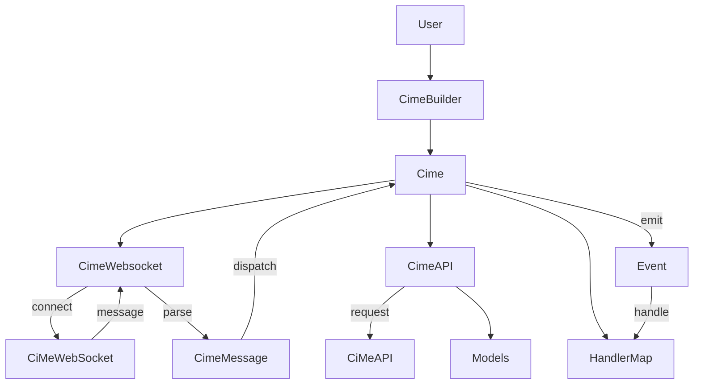
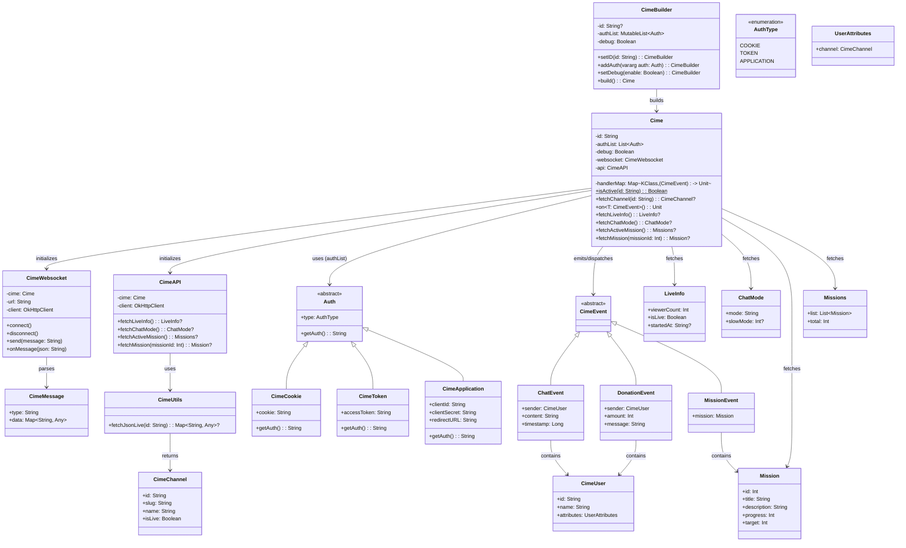

## 🏗️ 아키텍처

```mermaid
graph TD

    %% User flow
    User --> CimeBuilder
    CimeBuilder --> Cime

    %% Core
    Cime --> CimeWebsocket
    Cime --> CimeAPI
    Cime --> HandlerMap

    %% Networking
    CimeWebsocket -->|connect| CiMeWebSocket
    CimeAPI -->|request| CiMeAPI

    %% Event flow
    CiMeWebSocket -->|message| CimeWebsocket
    CimeWebsocket -->|parse| CimeMessage
    CimeMessage -->|dispatch| Cime
    Cime -->|emit| Event
    Event -->|handle| HandlerMap

    %% Data
    CimeAPI --> Models
```

### class

```mermaid
classDiagram
    %% ========== Core Classes ==========
    class Cime {
        -id: String
        -authList: List~Auth~
        -debug: Boolean
        -handlerMap: Map~KClass<out CimeEvent>, (CimeEvent) -> Unit~
        -websocket: CimeWebsocket
        -api: CimeAPI

        +isActive(id: String): Boolean$
        +fetchChannel(id: String): CimeChannel?
        +on~T: CimeEvent~(): Unit
        +fetchLiveInfo(): LiveInfo?
        +fetchChatMode(): ChatMode?
        +fetchActiveMission(): Missions?
        +fetchMission(missionId: Int): Mission?
    }

    class CimeBuilder {
        -id: String?
        -authList: MutableList~Auth~
        -debug: Boolean

        +setID(id: String): CimeBuilder
        +addAuth(vararg auth: Auth): CimeBuilder
        +setDebug(enable: Boolean): CimeBuilder
        +build(): Cime
    }

    %% ========== Auth Hierarchy ==========
    class Auth {
        <<abstract>>
        +type: AuthType
        +getAuth(): String
    }

    class CimeCookie {
        +cookie: String
        +getAuth(): String
    }

    class CimeToken {
        +accessToken: String
        +getAuth(): String
    }

    class CimeApplication {
        +clientId: String
        +clientSecret: String
        +redirectURL: String
        +getAuth(): String
    }

    class AuthType {
        <<enumeration>>
        COOKIE
        TOKEN
        APPLICATION
    }

    Auth <|-- CimeCookie
    Auth <|-- CimeToken
    Auth <|-- CimeApplication

    %% ========== Event System ==========
    class CimeEvent {
        <<abstract>>
    }

    class ChatEvent {
        +sender: CimeUser
        +content: String
        +timestamp: Long
    }

    class DonationEvent {
        +sender: CimeUser
        +amount: Int
        +message: String
    }

    class MissionEvent {
        +mission: Mission
    }

    CimeEvent <|-- ChatEvent
    CimeEvent <|-- DonationEvent
    CimeEvent <|-- MissionEvent

    %% ========== Data Models ==========
    class CimeChannel {
        +id: String
        +slug: String
        +name: String
        +isLive: Boolean
    }

    class LiveInfo {
        +viewerCount: Int
        +isLive: Boolean
        +startedAt: String?
    }

    class ChatMode {
        +mode: String
        +slowMode: Int?
    }

    class Mission {
        +id: Int
        +title: String
        +description: String
        +progress: Int
        +target: Int
    }

    class Missions {
        +list: List~Mission~
        +total: Int
    }

    class CimeUser {
        +id: String
        +name: String
        +attributes: UserAttributes
    }

    class UserAttributes {
        +channel: CimeChannel
    }

    class CimeMessage {
        +type: String
        +data: Map~String, Any~
    }

    %% ========== Networking ==========
    class CimeWebsocket {
        -cime: Cime
        -url: String
        -client: OkHttpClient

        +connect()
        +disconnect()
        +send(message: String)
        +onMessage(json: String)
    }

    class CimeAPI {
        -cime: Cime
        -client: OkHttpClient

        +fetchLiveInfo(): LiveInfo?
        +fetchChatMode(): ChatMode?
        +fetchActiveMission(): Missions?
        +fetchMission(missionId: Int): Mission?
    }

    class CimeUtils {
        +fetchJsonLive(id: String): Map~String, Any~?
    }

    %% ========== Relationships ==========
    CimeBuilder --> Cime : builds
    Cime --> CimeWebsocket : initializes
    Cime --> CimeAPI : initializes
    Cime --> Auth : uses (authList)
    Cime --> CimeEvent : emits/dispatches
    CimeWebsocket --> CimeMessage : parses
    CimeAPI --> CimeUtils : uses
    CimeUtils --> CimeChannel : returns
    Cime --> LiveInfo : fetches
    Cime --> ChatMode : fetches
    Cime --> Mission : fetches
    Cime --> Missions : fetches
    ChatEvent --> CimeUser : contains
    DonationEvent --> CimeUser : contains
    MissionEvent --> Mission : contains
```

