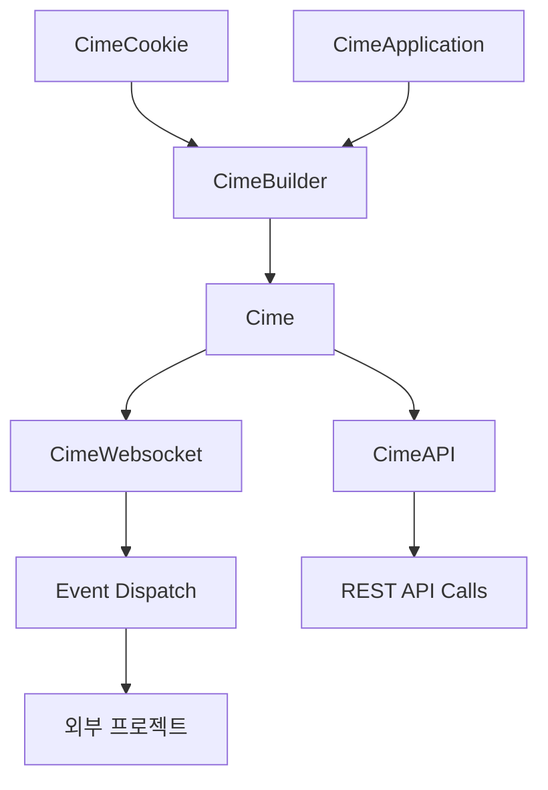

# 씨미 비공식 SDK


[](https://jitpack.io/#as7ar/cime4j)
[](http://kotlinlang.org)

[](https://deepwiki.com/as7ar/cime4j)

## 🗃️ Import the library

```gradle
repositories {
    maven { url = uri("https://jitpack.io") }
}


dependencies {
    implementation("com.github.as7ar:cime4j:Tag")
}
```

## 📄Usage

```kotlin
import io.github.astar.cime4j.Cime
import io.github.astar.cime4j.CimeBuilder
import io.github.astar.cime4j.auth.CimeCookie
import io.github.astar.cime4j.event.ChatEvent

// Cime 인스턴스 생성
val cime = CimeBuilder()
    .setID("streamer_id")
    .addAuth(CimeCookie("cookie_value")) // 스트리머 정보 조회시 필요
    .build()

// 채팅 이벤트 리스너 등록
cime.on<ChatEvent> { event ->
    println("${event.sender.attributes.channel.name}: ${event.content}")
}
```

### 방송 상태 확인

```kotlin
// 방송 중인지 확인
val isActive = Cime.isActive("streamer_id")
println("방송 상태: ${if (isActive) "방송중" else "오프라인"}")

// 채널 정보 가져오기
val channel = Cime.fetchChannel("streamer_id")
channel?.let {
    println("채널명: ${it.name}")
    println("방송 제목: ${it.liveTitle}")
}
```

### API를 통한 상세 정보 조회

```kotlin
// 시청자 수 가져오기
val liveInfo = cime.fetchLiveInfo()
liveInfo?.let {
    println("시청자 수: ${it.viewerCount}")
    println("채팅 모드: ${it.chatMode}")
}

// 활성 미션 가져오기
val missions = cime.fetchActiveMission()
missions?.missions?.forEach { mission ->
    println("미션: ${mission.title}")
    println("목표 금액: ${mission.targetAmount}")
}

// 채팅 모드 확인
val chatMode = cime.fetchChatMode()
chatMode?.let {
    println("채팅 가능 여부: ${it.isEnabled}")
}
```

## 🔧 인증 방법

### 쿠키 인증 (기본)

```kotlin
val cime = CimeBuilder()
    .setID("streamer_id")
    .addAuth(CimeCookie("your_cookie_string"))
    .build()
```

### OAuth2 애플리케이션 인증

```kotlin
import io.github.astar.cime4j.auth.CimeApplication
import io.github.astar.cime4j.api.auth.AuthManager

// 애플리케이션 credentials 설정
val app = CimeApplication(
    clientId = "your_client_id",
    clientSecret = "your_client_secret",
    redirectURL = "your_redirect_url"
)

// AuthManager를 통한 토큰 생성
val authManager = AuthManager(app)
val accessToken = authManager.accessTokenGenerator(
    grantType = AuthManager.GrantType.AUTHORIZATION_CODE,
    code = "authorization_code"
)
```

## 📡 이벤트 처리

### 연결 이벤트

```kotlin
import io.github.astar.cime4j.event.ConnectionEvent

cime.on<ConnectionEvent> { event ->
    println("WebSocket 연결됨: ${event.streamerId}")
}
```

### 기본 이벤트 구조

```kotlin
// 모든 이벤트는 CimeEvent를 상속받음
cime.on<ChatEvent> { event ->
    // 이벤트 속성 접근
    println("스트리머 ID: ${event.streamerId}")
    println("메시지: ${event.content}")
    println("발신자: ${event.sender.attributes.channel.name}")
    println("발신자 ID: ${event.sender.userId}")
}
```

# 🔨 Tech Stack

## 🏗️ 아키텍처



| Component | Link                                          | Content             | Status |
|-----------|-----------------------------------------------|---------------------|--------|
| chzzk4j   | [Link](https://github.com/R2turnTrue/chzzk4j) | Event Listener      | ✅      |

# 👤Support Discord Server
https://discord.gg/BCqWwvr888
